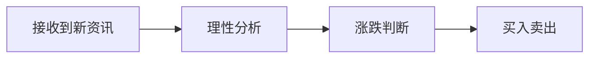
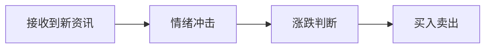

___
2025-03-2110:04
##### 目标：
改造 GTD 的流程,建立 archia 需求收集及连成线的文档(含流程)
对全局有个基本的,感性的判断

##### 为什么要做这件事？（简单写1-2句）
昨天梳理过程中,发现可能的/好用的场景其实很多,但有点散乱,需要传起来
逻辑是有场景,场景成故事线,根据故事线指定工作流,然后是 agent
整理出故事线,就能剥离出技能
与此同时,目前看交易中的情绪,是这个过程的暗线

上述只是开场,还没涉及为什么要引入 GTD:
这个过程不可能是一蹴而就的,不仅仅是当前阶段,未来也会持续增加
即使就当前阶段而言,而是大/杂/陌生的信息(esp 项目方等),不规范化,可能会有较大的效率浪费
GTD 中,对信息输入和整理有一套流程,本来就像用,刚好 match

##### 现在用5分钟就可以做的一小步：
- [x] 回顾已收集到的内容
- [ ] 回顾 GTD 的方式
- [ ] 整理过去几天中的灵感,以及睡前想到的框架

##### 如果遇到干扰，我会：

___

具体到场景,交易员的实际交易过程:

