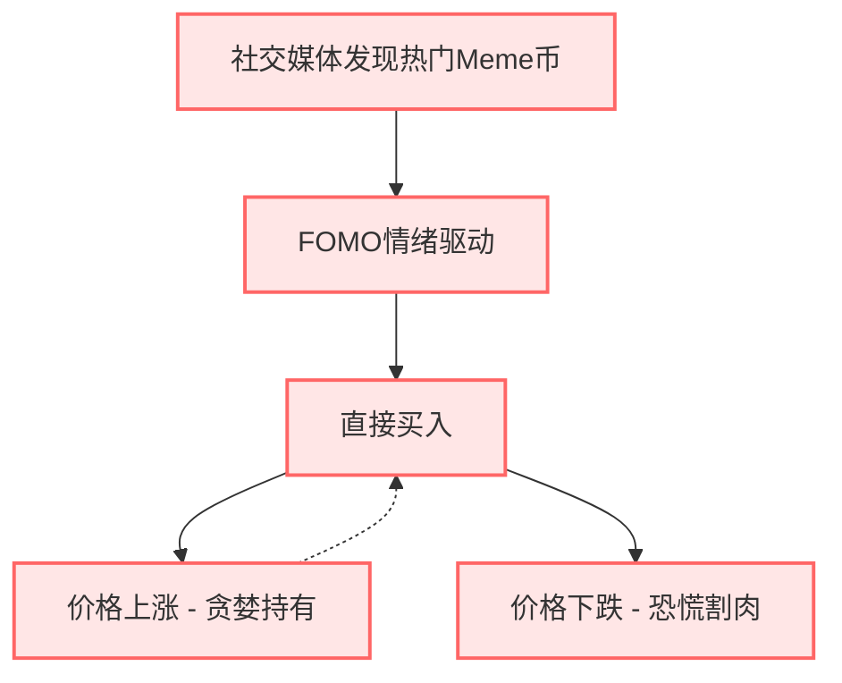
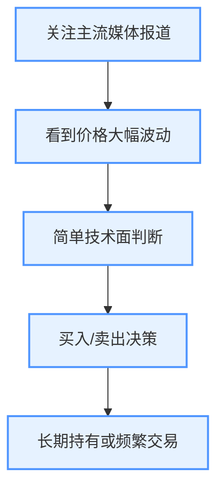
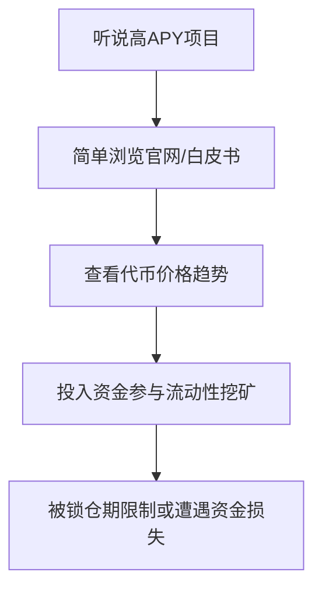
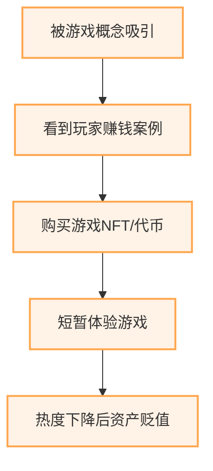
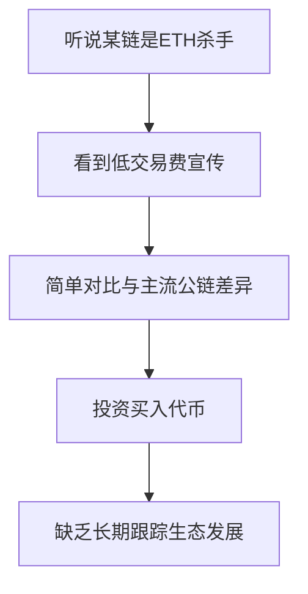

# 新手交易流程分析（基于不同币种类型）

## 1. Meme币新手交易流程

**Meme币新手交易流程说明：**
1. **社交媒体发现热门Meme币** - 通过Twitter、Telegram、Discord等社交媒体发现正在热炒的Meme币
2. **FOMO情绪驱动** - 害怕错过暴涨机会，几乎不做任何研究和分析
3. **直接买入** - 迅速在交易所或DEX购买，通常不考虑买入时机和价格
4. **两种结果路径**：
   - **价格上涨** - 贪婪心理导致持续持有，不设止盈点
   - **价格下跌** - 恐慌情绪导致割肉离场，通常在最低点卖出

## 2. 主流币（BTC/ETH）新手交易流程

**主流币新手交易流程说明：**
1. **关注主流媒体报道** - 通过新闻、财经媒体了解比特币、以太坊等主流币动态
2. **看到价格大幅波动** - 价格大涨大跌时才引起注意
3. **简单技术面判断** - 可能会看一些基础K线图，但分析能力有限
4. **买入/卖出决策** - 基于有限信息和主观判断做出决策
5. **长期持有或频繁交易** - 要么采取"买入后忘记"策略，要么过度交易

## 3. DeFi项目币新手交易流程

**DeFi项目币新手交易流程说明：**
1. **听说高APY项目** - 被高收益率吸引，通常从社交媒体或朋友处获知
2. **简单浏览官网/白皮书** - 浏览项目介绍，但不深入研究技术和经济模型
3. **查看代币价格趋势** - 简单看一下价格历史，主要关注短期涨幅
4. **投入资金参与流动性挖矿** - 直接参与项目，通常投入过多资金
5. **被锁仓期限制或遭遇资金损失** - 因为没有了解清楚机制，往往在项目下跌时无法及时退出

## 4. GameFi/NFT游戏币新手交易流程

**GameFi/NFT游戏币新手交易流程说明：**
1. **被游戏概念吸引** - 对"边玩边赚"概念感兴趣
2. **看到玩家赚钱案例** - 被早期玩家的高收益案例吸引
3. **购买游戏NFT/代币** - 投入资金购买游戏装备或代币
4. **短暂体验游戏** - 简单体验游戏玩法，但通常缺乏长期参与的耐心
5. **热度下降后资产贬值** - 当游戏热度过去，发现资产大幅贬值

## 5. 新兴公链或Layer2代币新手交易流程

**新兴公链代币新手交易流程说明：**
1. **听说某链是"ETH杀手"** - 被营销宣传吸引，认为找到了"下一个以太坊"
2. **看到低交易费宣传** - 被低Gas费、高TPS等技术指标吸引
3. **简单对比与主流公链差异** - 进行表面的比较，但不深入了解技术架构
4. **投资买入代币** - 基于有限信息做出投资决策
5. **缺乏长期跟踪生态发展** - 买入后不关注生态系统发展和开发者活跃度

## 总结

新手交易者的流程普遍存在以下问题：
1. **流程过短** - 缺少完整的分析、风险评估和复盘环节
2. **情绪驱动** - 主要由FOMO和恐慌等情绪推动决策
3. **信息不足** - 依赖单一或不可靠的信息来源
4. **缺乏风控** - 没有止损策略和资金管理计划
5. **忽视复盘** - 不进行交易记录和经验总结

不同类型的币种会触发新手不同的心理反应和行为模式，但共同点是决策过程简化且缺乏系统性。这也解释了为什么大多数新手在加密市场中容易亏损。