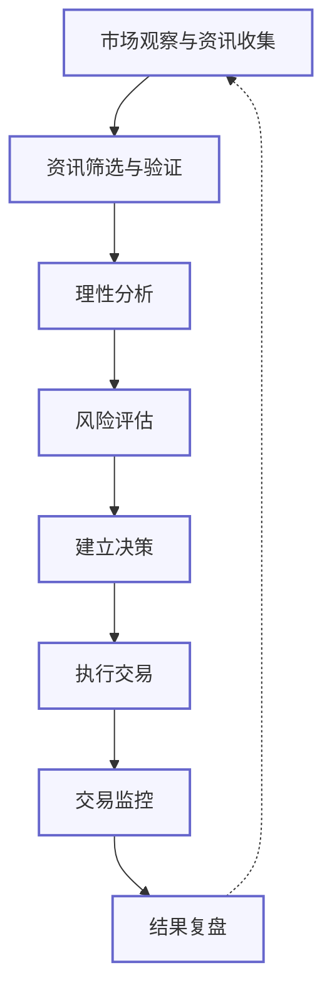

## 理性的交易流程

## 2.新手老手的的差异

| 流程点 | 新手问题 | 顶级交易员做法 |
|--------|----------|----------------|
| **市场观察与资讯收集** | • 不知道关注哪些信息源 #知识 • 信息获取渠道单一 #方法 • 无法区分重要信息和噪音 #技能 • 容易被FOMO情绪驱动盲目跟风 #情绪 • 缺乏系统性的信息收集方法 #方法 | • 建立多元化信息渠道 #方法 • 构建信息过滤系统 #工具 • 保持市场敏感度 #技能 • 建立专业人脉网络 #资源 • 关注宏观经济和监管动态 #知识 |
| **资讯筛选与验证** | • 无法判断信息真实性和可信度 #技能 • 不了解如何交叉验证信息 #方法 • 容易被有影响力的KOL言论左右 #情绪 #判断 • 无法识别市场操纵和虚假信息 #经验 • 对技术性信息理解不足 #知识 | • 多源交叉验证 #方法 • 建立信息可信度评分系统 #工具 • 识别信息偏见 #技能 • 关注一级市场动态 #知识 • 使用链上分析工具 #工具 #技能 |
| **理性分析** | • 分析框架不完善 #方法 • 对基本面和技术面分析能力不足 #技能 #知识 • 无法建立资讯与市场行为的关联 #经验 • 分析过程中夹杂主观情绪 #情绪 • 过度依赖单一分析方法 #方法 | • 使用多维分析框架 #方法 • 量化分析与定性分析结合 #技能 • 情景分析 #方法 • 识别市场周期位置 #经验 #知识 • 关注反向指标 #技能 #判断 |
| **风险评估** | • 风险意识薄弱 #意识 • 不了解如何计算风险回报比 #技能 • 忽视市场流动性风险 #知识 • 对黑天鹅事件准备不足 #经验 • 未考虑资金管理 #方法 | • 系统性风险管理 #方法 • 压力测试 #技能 • 流动性分析 #技能 • 相关性分析 #技能 #知识 • 制定应急预案 #方法 |
| **建立决策** | • 决策过程不系统 #方法 • 难以在多种可能性中做出选择 #判断 • 决策受情绪波动影响大 #情绪 • 缺乏明确的进场和出场标准 #方法 • 决策与自身投资目标不匹配 #意识 | • 概率思维 #思维 • 设定明确的交易规则 #方法 • 与整体策略保持一致 #方法 • 控制仓位大小 #技能 • 设定预期结果 #方法 |
| **执行交易** | • 交易时机把握不准 #技能 • 对交易成本认识不足 #知识 • 不熟悉交易平台操作 #技能 • 容易出现操作失误 #技能 • 执行力不足,犹豫不决 #情绪 | • 选择最优执行路径 #技能 • 分批建仓/平仓 #方法 • 使用高级交易工具 #工具 • 保持纪律性 #意识 • 避免过度交易 #判断 |
| **交易监控** | • 缺乏持续关注市场的习惯 #意识 • 不知道如何设置止盈止损 #技能 • 对市场变化反应迟钝 #技能 • 无法灵活调整策略 #方法 • 过度关注短期价格波动 #情绪 | • 实时监控市场变化 #方法 • 动态调整止损位置 #技能 • 监控相关市场信号 #技能 • 情绪自我监控 #情绪 • 定期评估交易进展 #方法 |
| **结果复盘** | • 不进行交易记录和总结 #方法 • 无法客观评估交易结果 #判断 • 归因错误 #思维 • 不从错误中学习 #意识 • 缺乏持续改进的意识 #意识 | • 详细记录每笔交易 #方法 • 定期分析交易表现 #方法 • 持续优化交易系统 #意识 • 从错误中学习而非自责 #思维 • 寻求外部反馈 #资源 |

## 3. 分类标签说明

1. **#情绪** - 与心理状态、情绪控制相关的问题和解决方案
2. **#方法** - 与系统、流程、策略相关的内容
3. **#技能** - 需要练习和掌握的具体能力
4. **#知识** - 需要学习和了解的信息和理论
5. **#意识** - 与思维模式、认知框架和自我意识相关

次要分类标签:
- **#判断** - 与决策能力和判断力相关
- **#工具** - 与使用特定工具和系统相关
- **#资源** - 与外部资源和网络相关
- **#思维** - 与思考方式和思维模型相关
- **#经验** - 需要通过实践积累的经验

### 标签的二次分类

![[Pasted image 20250321113609.png]]

![[Pasted image 20250321113644.png]]

![[Pasted image 20250321113739.png]]

![[Pasted image 20250321113826.png]]